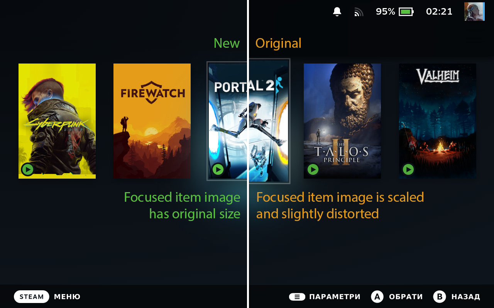
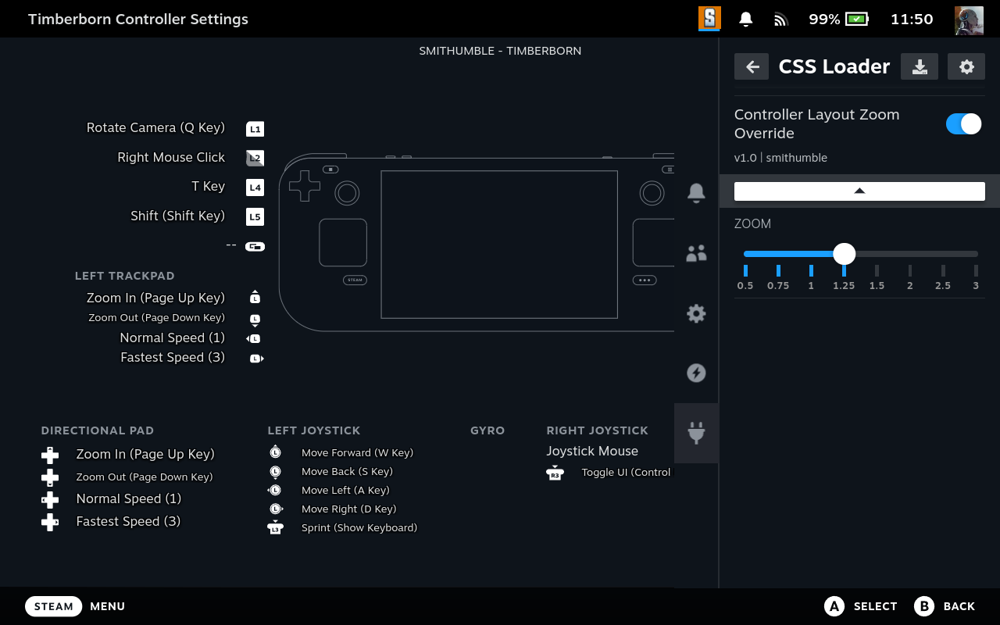

# Steam Deck Themes

This repository contains various themes that I created for use with [suchmememanyskill's Steam Deck CSS loader](https://github.com/suchmememanyskill/SDH-CssLoader).

## Themes

### No Focused Library Item Scale

Removes the scaling of focused library items in library and home screen. As one of the benefits, it prevents image distortion.

### Controller Layout Zoom Override

Override the zoom of the controller layout view. The main goal was to fix the controller layout zoom issue with manual global user interface scaling.

